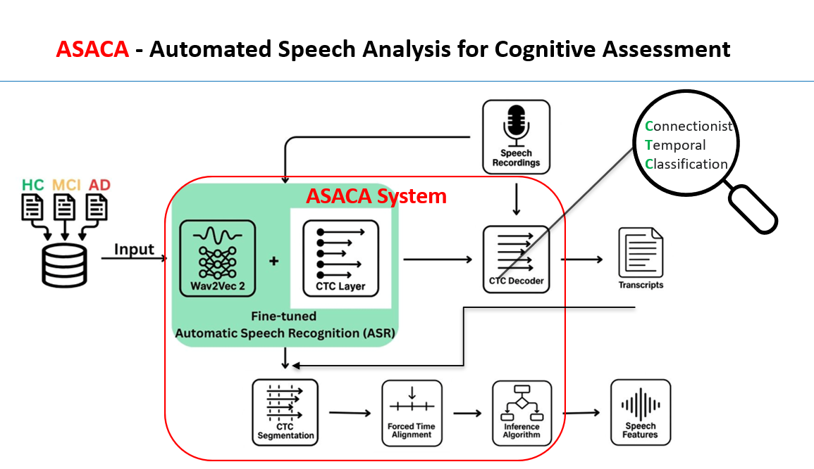

# ASACA – Automatic Speech Analysis for Cognitive Assessments
[](../../actions) 
[](https://pypi.org/project/asaca/) 
[](LICENSE) 
[](#)


ASACA is an **end-to-end toolkit** that transforms raw speech into
multimodal biomarkers — lexical, prosodic and pause-based — and returns
an interpretable prediction ( *HC / MCI / AD* ) and low Word error rate transcriptions (WER <0.02)).

---

## ✨ Key Features
| Capability | Detail |
|------------|--------|
| **Single-command inference** | `asaca run audio.wav` outputs JSON + PDF report |
| **Fine-tuned wav2vec 2.0 ASR** | < 2 % WER on in-domain test set |
| **Explainability** | SHAP plots per classification |
| **Rich feature set** | word-error rate, syllable rate, pause stats, spectral cues |
| **Offline-ready** | Model weights stored under `Models/` via Git LFS |
| **PEP 517/621 packaging** | `pip install asaca` or editable mode |


---

## 🚀 Quick start

Install the package from PyPI and run inference on a WAV file:

```bash
pip install asaca
asaca-cli infer path/to/audio.wav -o out/
```
The first run automatically downloads the fine-tuned ASR model from
[Hugging Face](https://huggingface.co/xyang2/ASACA_ASR) along with the
required NLTK corpora.

Alternatively install in editable mode for development:

```bash
git clone https://github.com/RhysonYang-2030/ASACA-Automatic-Speech-Analysis-for-Cognitive-Assessment.git
cd ASACA-Automatic-Speech-Analysis-for-Cognitive-Assessment
pip install -e .[dev]
```

The CLI outputs recognised text along with a PDF report and JSON file in the
specified output directory.

## Usage



```text
asaca/
├── src/             # library code
├── tests/           # unit tests
├── docs/            # MkDocs documentation
├── examples/        # example notebooks and data
└── notebooks/       # tutorial notebooks
```

Run `asaca-cli --help` to see all commands including feature extraction.

## Documentation
Full API reference and user guide live in the [`docs/`](docs/) directory and on [Read the Docs](https://example.com/).

## Docker

Build the image and run inference in an isolated environment:

```bash
docker build -t asaca .
docker run --rm -v "$PWD:/data" asaca asaca-cli infer /data/audio.wav
```

The container entrypoint defaults to `asaca-cli`.

## License
Released under the Apache-2.0 license.

## Citation
If you use ASACA in your research, please cite the project using the
[CITATION.cff](CITATION.cff) file.

## Contact
Maintainer: [Xinbo Yang](mailto:xyang2@tcd.ie)
